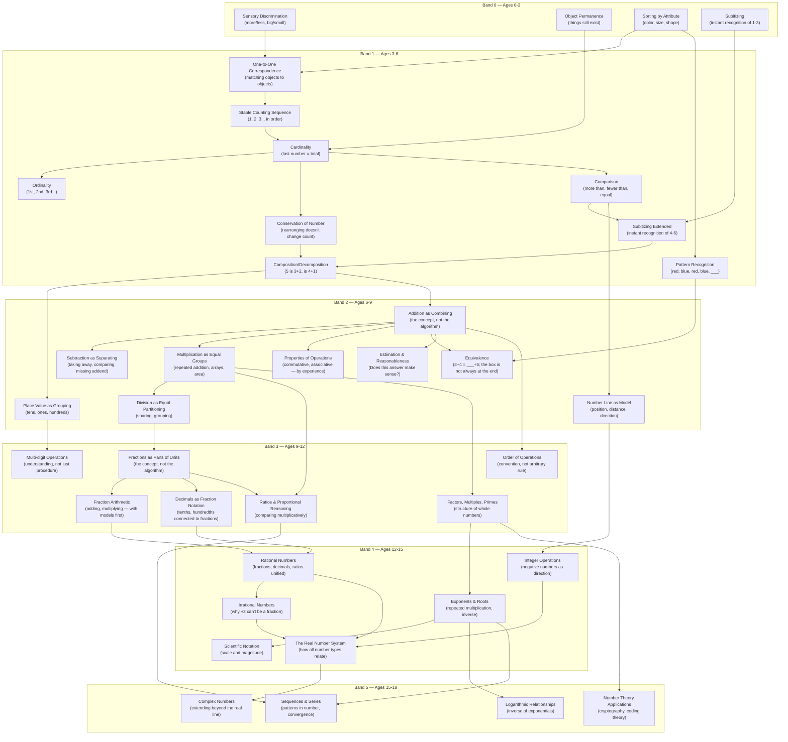
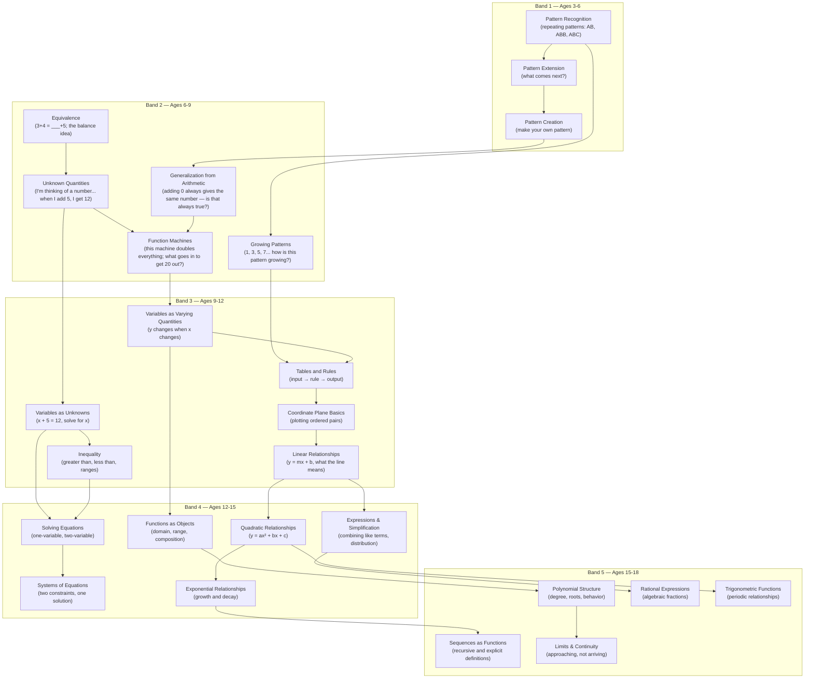
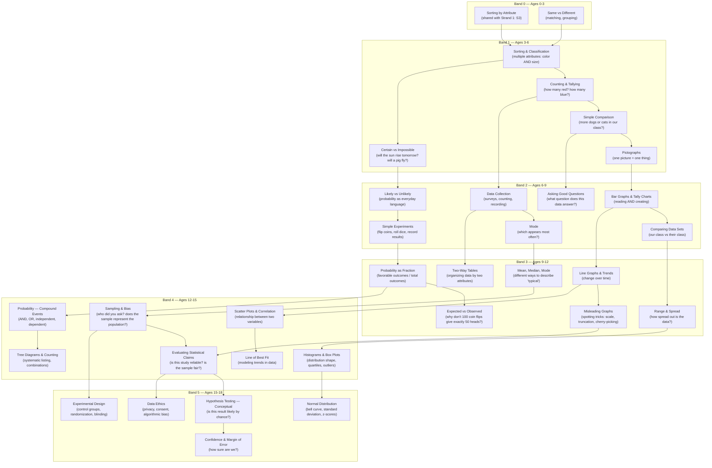

# Mathematics Curriculum Spine

> The spine is the school. The app is infrastructure. The AI is the steward.

This document defines the **structure** from which all math activities are generated. It maps birth through Grade 12 across five mathematical strands, six developmental bands, four cognitive levels, and one cross-cutting progression (Reasoning & Proof).

---

## Part 0: Who Is This App For?

### The Parent Is the Primary User

Learn Live is a **parent-facing application**. The parent opens the app, sees the task, leads the child through it (or, at higher bands, permits the child to lead themselves), and records the outcome.

> [!IMPORTANT]
> The app does NOT default to putting a child in front of a screen with an AI. The parent is the primary witness, the primary facilitator, and the primary judge at **every** developmental band.

### The Flow at Every Band

```
Parent opens app → Sees today's task + constraint prompt →
  Option A: Parent leads the activity → Parent writes the report → Parent advances/revises
  Option B: Parent captures photo + audio → Async AI drafts the report → Parent reviews → Parent advances/revises
  Option C: Parent invokes Live AI Witness → AI observes in real-time → AI drafts report → Parent reviews
  Option D (Band 3+): Parent grants child access to Child Portal → Child leads → Parent reviews → Parent advances/revises
```

**Option A is always available. Options B, C, D are always optional. Option D unlocks gradually.**

### The Four Witness Modes

| Mode | How Evidence Is Captured | Cost / Bandwidth | When It's Used |
|---|---|---|---|
| **Parent Witness** | Parent observes, writes guided report | Free, offline-capable | Default at all bands. Always available. |
| **Async AI** | Photo of work + 10-second audio clip of child explaining → AI analyzes and drafts report asynchronously | Low cost, low bandwidth | The workhorse. Quick, reliable, works in low-bandwidth contexts. |
| **Live AI Witness** | Real-time camera/mic → AI observes and interacts | Higher cost, needs stable connection | Complex tasks, verbal assessment, Discern-level challenges. |
| **Child-Led** | Child submits evidence (photos, recordings, written work) → AI or parent reviews | Varies | Band 3+. Parent grants portal access. |

> [!TIP]
> **Async AI is the default AI mode, not Live.** A photo of grouped beans + a 10-second audio clip of the child explaining is cheaper, more reliable, and works in low-bandwidth contexts. The Live AI Witness is reserved for tasks where real-time interaction adds genuine value (verbal reasoning, Discern-level challenges).

### The Split Judgment Model

> [!IMPORTANT]
> At Bands 4–5, the parent cannot be expected to evaluate subject-matter competence in advanced mathematics. The system must split the judgment:

| What Is Being Judged | Who Judges | Example |
|---|---|---|
| **Mathematical competence** — Is the work correct? Does the model fit? Is the proof valid? | **AI or qualified reviewer** | "The quadratic model has a positive 'a' for a downward arc — mathematically invalid." |
| **Formation & character** — Did the child persevere? Accept correction? Work diligently? Take ownership? | **Parent (always)** | "She revised three times without complaint and defended her reasoning clearly." |
| **Advancement** — Is the child ready for more responsibility? | **Parent (always)** — informed by both competence and formation reports | "Math is verified correct. She also showed endurance and revision. Advance." |

**This means:**
- **Bands 0–3**: Parent judges everything (math is simple enough)
- **Band 3**: Parent may receive a **parent primer** — a brief orientation explaining the concept, common mistakes, and what to look for (so the parent can evaluate effectively even without deep math background)
- **Band 4–5**: AI verifies mathematical correctness. Parent evaluates character and formation. Parent still holds advancement authority.

The parent's authority is **never removed**. What changes is what they're asked to evaluate: not "is this equation correct?" but "is this child becoming more faithful, competent, and responsible?"

### The Constraint Prompt: Serves the Parent First

Every task generates a **constraint prompt** shown to the parent:

```
"Your child needs to divide 12 beans equally into 3 groups.
Ask them to explain why the groups are equal.
Success: Each group has exactly 4 beans AND child uses words like 'same', 'equal', 'fair'.
If they struggle: prompt them with 'Are all groups the same? How do you know?'"
```

The parent can: use it themselves, send photo+audio to Async AI, or invoke the Live AI Witness.

### The Child Portal: Gradual Handoff

The app starts as **100% parent-facing**. No child login until the parent creates one.

| Band | Child Portal | Parent Competence Support |
|---|---|---|
| **Band 0** (0–3) | None. Parent only. | Guidance cards only. |
| **Band 1** (3–6) | None. Parent facilitates. | Constraint prompts guide the parent. |
| **Band 2** (6–9) | Read-only task view (parent's choice). | Constraint prompts + success/failure criteria. |
| **Band 3** (9–12) | Task execution access (parent's choice). | **Parent primers** — concept orientation + common mistakes. |
| **Band 4** (12–15) | Full child-led mode (parent's choice). | **Split judgment** — AI checks math, parent checks formation. |
| **Band 5** (15–18) | Independent. Parent reviews portfolio. | **Split judgment** + option to delegate to qualified reviewer. |

---

## Part I: Architecture of the Spine

### How a Spine Cell Works

Every teachable unit in mathematics is a **Capacity**. Each Capacity lives at the intersection of:

| Axis | What It Represents | Example |
|---|---|---|
| **Strand** | The mathematical domain | Number & Quantity |
| **Capacity** | The specific skill/concept | Equal Partitioning (the essence of division) |
| **Cognitive Level** | Depth of understanding | Execute (can do it under constraint) |
| **Repetition Arc** | Volume + type of practice | Endurance 2 of 3 (noise-injected task) |
| **Developmental Band** | Stage appropriateness | Band 2 (ages 6–9) |

**The app reads a cell** → generates a task instance → presents the constraint prompt to the parent → parent witnesses (or invokes AI) → evidence is logged → parent judges.

### The Four Cognitive Levels

| Level | Name | What the Learner Does | What the Witness Checks (Parent or AI) |
|---|---|---|---|
| **1** | **Encounter** | Meets the concept through a real task. Describes it. Demonstrates basic recognition. | "Show me what you did. Tell me what you notice." |
| **2** | **Execute** | Performs the task under constraint. Produces a real, evaluable output. | Enforces constraint, checks output against success criteria. |
| **3** | **Discern** | Detects errors, compares approaches, explains *why* something works or fails. | "What's wrong here? Which is better? Why?" |
| **4** | **Own** | Designs tasks for others, transfers to new domains, teaches, models, specifies. | Witnesses specification and defense — testing true ownership. |

### The Repetition Arc (Operationally Defined)

The Z-axis **Repetition Arc** operates *within* each cognitive level. Each stage has a distinct purpose:

| Stage | Count | What Happens | Why It Exists | Equal Partitioning Example |
|---|---|---|---|---|
| **Exposure** | 1x | First encounter. Guided. Scaffolded. | Orientation — the child sees what this is. | "Divide 12 beans into 3 groups. I'll help." |
| **Execution** | 3–5x | Repeated practice with parameter variation. | Builds fluency through varied repetition. | "Divide 15 into 5. Divide 20 into 4. Now try one with a remainder." |
| **Endurance** | 2–3x | Same task + **noise injected**. Irrelevant data, distracting context, the child must filter. | Tests robustness — can they do it when the situation is messy? | "Here are 18 beans AND 5 buttons. Divide only the beans into 3 groups. Ignore the buttons." |
| **Milestone** | 1x | **Cross-strand, unlabeled task**. Nobody tells the child which tool to use — they must recognize the situation and apply the correct capacity. | Tests transfer and recognition — the real proof of formation. | "Your friend has 24 stickers and 6 friends. What should she do?" (Nobody says 'division.') |

> [!IMPORTANT]
> **Execution count is capacity-dependent, not fixed.** Foundational capacities (place value, fractions, proportional reasoning) may need 5–7 executions. Procedural capacities may need 3. The spine specifies a range per capacity, not a universal constant. The parent (informed by evidence) decides when to move to Endurance.

A learner doesn't advance from one cognitive level to the next until the full repetition arc is complete.

### The AI Permission Rule

> A learner may use AI tools **only after** they can do three things without them:
> 1. **Predict** what a good answer should roughly look like
> 2. **Diagnose** what went wrong when the answer is bad
> 3. **Specify** constraints that meaningfully shape the output

This is **capacity-gated**, not age-gated.

---

## Part II: Developmental Bands

| Band | Ages | Grades | Core Mode | Who Leads | AI Witness | Parent Support |
|---|---|---|---|---|---|---|
| **0** | 0–3 | Pre-school | Sensory & Motor | Parent only | N/A | Guidance cards |
| **1** | 3–6 | Pre-K to K | Concrete Manipulation | Parent leads | Optional (Async or Live) | Constraint prompts |
| **2** | 6–9 | Grades 1–3 | Concrete Mastery | Parent leads | Optional | Constraint prompts |
| **3** | 9–12 | Grades 4–6 | Bridging Abstract | Parent or Child | Available | **Parent primers** |
| **4** | 12–15 | Grades 7–9 | Abstract Reasoning | Child leads | AI as collaborator | **Split judgment** |
| **5** | 15–18 | Grades 10–12 | Formal & Applied | Child independent | AI as full tool | **Split judgment** + reviewer |

### The Critical Principle: Tasks Get Bigger, Not Easier

At every band transition:
- **Task scope expands** (from "divide 12 objects" to "design a resource allocation system")
- **Constraints tighten** (from "get the right answer" to "justify every modeling decision")
- **AI tools unlock** — only because the task is now too big without them AND the student can evaluate the output
- **Child's independence increases** — but always at the parent's discretion
- **Parent's evaluation shifts** — from checking math directly to evaluating formation while AI checks math

**AI does not replace the parent. AI does not replace hand computation. AI makes tasks ambitious enough that hand computation alone would be insufficient.**

---

## Part III: The Five Mathematical Strands + One Cross-Cutting Progression

### The Five Strands (X-Axis)

| # | Strand | Description |
|---|---|---|
| 1 | **Number & Quantity** | The bedrock. From subitizing to the real number system. |
| 2 | **Algebraic Thinking & Structure** | From patterns to functions to systems. The grammar of mathematics. |
| 3 | **Spatial Reasoning & Geometry** | From shape recognition to geometric proof. How space works. |
| 4 | **Data, Probability & Statistics** | From sorting to statistical inference. How uncertainty works. |
| 5 | **Mathematical Modeling & Systems** | The capstone. Converges all other strands into real-world problem design. |

> [!WARNING]
> **Strand 5 is a capstone, not an independent strand.** Its nodes are compositions of nodes from other strands. It does NOT have its own independent concept DAG. Its activation rule: a Strand 5 task requires specified prerequisite capacities from Strands 1–4 to be at Discern or Own level. This must be enforced at the data model layer.

### The Cross-Cutting Progression: Reasoning & Proof

Reasoning & Proof is NOT a separate strand — it is a **progression that runs through every strand at every band**. It is the capacity to justify, argue, and prove — the core of mathematics itself.

| Band | Reasoning Capacity | What It Looks Like | Example Across Strands |
|---|---|---|---|
| **1** | **"Because" reasoning** | Child gives a reason for their answer, not just the answer. | "I put those together *because* they're both red." |
| **2** | **Justification** | Child explains *why* an answer must be correct, not just *that* it is. | "12 ÷ 3 = 4 because 3 × 4 = 12." |
| **2** | **Estimation & Sense-Making** | Child judges whether an answer is reasonable before checking. | "50 + 30 can't be 20 because both numbers are big." |
| **3** | **Counterexample** | Child disproves a false claim by finding a specific case. | "Not all even numbers are divisible by 4 — 6 is even but 6 ÷ 4 isn't whole." |
| **3** | **Generalization** | Child states a rule that always works and tests it. | "Adding 0 to any number gives back the same number. Is that *always* true?" |
| **4** | **Logical argument** | Student constructs a chain of reasoning that forces a conclusion. | "The sum of two odd numbers is always even: (2a+1) + (2b+1) = 2(a+b+1)." |
| **4** | **Structural analysis** | Student explains *why* a mathematical structure behaves the way it does. | "This equation opens downward because 'a' is negative — that's not a fact to memorize, it's forced by the structure." |
| **5** | **Formal proof** | Student constructs proofs by contradiction, induction, or deduction. | "Prove that √2 is irrational. Assume it is rational and derive a contradiction." |

> [!IMPORTANT]
> Every capacity at every cognitive level should incorporate reasoning. At **Encounter**, the child describes ("I notice..."). At **Execute**, the child justifies ("It must be... because..."). At **Discern**, the child argues ("This is wrong because..."). At **Own**, the child proves ("This always works because..."). Reasoning is not a bolt-on — it is the thread that runs through every cell.

---

## Part IV: Concept DAG — Strand 1: Number & Quantity

Every capacity is a node. Arrows show prerequisites.



> [!NOTE]
> New nodes added from feedback: **C9 (Pattern Recognition)**, **D8 (Equivalence)**, **D9 (Estimation & Reasonableness)**. These seed pre-algebraic thinking and estimation into Bands 1–2 where modern research says they belong.

---

## Part IVb: Concept DAG — Strand 2: Algebraic Thinking & Structure

Algebraic thinking starts **much earlier than traditional algebra.** The cognitive roots — patterns, equivalence, generalization, unknown quantities — begin at Band 1.



> [!NOTE]
> **A1 (Pattern Recognition) is shared with Strand 1 node C9.** This is the first cross-strand link. The DAG engine must handle shared nodes — a capacity achieved in one strand counts for prerequisites in another.

### Cross-Strand Dependency Rule

When a child is at Band 3 in Strand 1 but Band 2 in Strand 2, the system:

1. **Does NOT block all progress.** The child continues advancing in the strand where they're stronger.
2. **Flags dependent nodes.** Any Strand 1 or Strand 2 node that requires a prerequisite from the weaker strand is marked "prerequisites not met — waiting."
3. **Suggests lateral movement.** The app recommends tasks in the weaker strand's Encounter/Execute levels, keeping the child moving.
4. **The parent decides.** The parent sees: "Your child is ready for Ratios (Strand 1) but needs Proportional Reasoning (Strand 2) first. Here are some tasks to build that capacity."

This prevents DAG deadlocks while respecting prerequisite integrity.

---

## Part IVc: Concept DAG — Strand 3: Spatial Reasoning & Geometry

Spatial reasoning is not a luxury strand — it is fundamental to how humans interact with the physical world. It begins with a toddler learning "on top of" and ends with formal geometric proof. Note: measurement lives here, not in Number & Quantity, because measurement is fundamentally about spatial relationships expressed through number.

```mermaid
graph TD
    subgraph "Band 0 — Ages 0-3"
        GS1["Spatial Language<br/>(on top, inside, next to, under)"]
        GS2["Shape Exploration<br/>(holds, stacks, rolls objects)"]
        GS3["Size Comparison<br/>(big/small, tall/short, long/short)"]
    end

    subgraph "Band 1 — Ages 3-6"
        G1a["Shape Recognition<br/>(circle, square, triangle, rectangle)"]
        G1b["Shape Properties<br/>(sides, corners — by touching)"]
        G1c["Positional Reasoning<br/>(above, below, beside, between)"]
        G1d["Simple Symmetry<br/>(is this the same on both sides?)"]
        G1e["Non-Standard Measurement<br/>(how many hand-widths long?)"]
        G1f["Sorting Shapes<br/>(by attribute: sides, curves, size)"]
    end

    subgraph "Band 2 — Ages 6-9"
        G2a["2D Shape Classification<br/>(polygons, properties, naming)"]
        G2b["3D Shape Recognition<br/>(cube, sphere, cylinder, cone, prism)"]
        G2c["Standard Measurement — Length<br/>(rulers, cm, m)"]
        G2d["Standard Measurement — Mass & Capacity<br/>(kg, litres)"]
        G2e["Perimeter<br/>(distance around — by counting/measuring)"]
        G2f["Area — Conceptual<br/>(how many squares fit inside?)"]
        G2g["Line Symmetry<br/>(folding, mirrors, reflection)"]
        G2h["Directions & Simple Maps<br/>(left, right, compass, grid references)"]
    end

    subgraph "Band 3 — Ages 9-12"
        G3a["Angle as Rotation<br/>(degrees, right angles, measuring)"]
        G3b["Perimeter & Area Formulas<br/>(rectangles, triangles, compound shapes)"]
        G3c["Volume — Conceptual<br/>(how many cubes fit inside?)"]
        G3d["Volume Formulas<br/>(rectangular prisms, cylinders)"]
        G3e["Coordinate Plane<br/>(plotting, reading, quadrants)"]
        G3f["Transformations — Intuitive<br/>(slides, flips, turns — physically)"]
        G3g["Scale & Proportion<br/>(maps, models, enlargement/reduction)"]
        G3h["Unit Conversion<br/>(cm to m, g to kg, ml to L)"]
    end

    subgraph "Band 4 — Ages 12-15"
        G4a["Angle Relationships<br/>(complementary, supplementary, parallel line angles)"]
        G4b["Triangle Properties<br/>(angle sum, types, congruence criteria)"]
        G4c["Pythagorean Theorem<br/>(proof by area, applications)"]
        G4d["Transformations — Formal<br/>(translation, rotation, reflection on coordinate plane)"]
        G4e["Similarity & Congruence<br/>(when shapes are the same, when proportional)"]
        G4f["Surface Area<br/>(nets, unfolding 3D shapes)"]
        G4g["Circle Properties<br/>(radius, diameter, circumference, pi, area)"]
        G4h["Introduction to Trigonometry<br/>(right triangles, sine, cosine, tangent)"]
    end

    subgraph "Band 5 — Ages 15-18"
        G5a["Geometric Proof<br/>(deductive reasoning about shapes)"]
        G5b["Trigonometry — Extended<br/>(unit circle, non-right triangles, identities)"]
        G5c["Coordinate Geometry<br/>(distance, midpoint, equations of lines/circles)"]
        G5d["Vectors<br/>(magnitude, direction, operations)"]
        G5e["Locus & Construction<br/>(compass/straightedge, loci of points)"]
    end

    GS1 --> G1c
    GS2 --> G1a
    GS3 --> G1e
    GS2 --> G1b
    G1a --> G1f
    G1a --> G1d
    G1a --> G2a
    G1b --> G2a
    G1c --> G2h
    G1e --> G2c
    G1e --> G2d
    G2a --> G2b
    G1d --> G2g
    G2c --> G2e
    G2e --> G2f
    G2a --> G3a
    G2e --> G3b
    G2f --> G3b
    G2f --> G3c
    G3c --> G3d
    G2h --> G3e
    G2g --> G3f
    G2c --> G3h
    G2d --> G3h
    G3b --> G3g
    G3a --> G4a
    G4a --> G4b
    G3b --> G4c
    G3f --> G4d
    G3e --> G4d
    G4b --> G4e
    G3g --> G4e
    G3d --> G4f
    G3a --> G4g
    G4b --> G4h
    G4c --> G4h
    G4b --> G5a
    G4e --> G5a
    G4h --> G5b
    G4d --> G5c
    G3e --> G5c
    G5c --> G5d
    G5a --> G5e
```



**Cross-Strand Links from Strand 3:**
- G3e (Coordinate Plane) is shared with Strand 2 node C4a — the coordinate plane serves both geometry and algebra
- G3g (Scale & Proportion) requires Strand 1 E5 (Ratios & Proportional Reasoning)
- G4c (Pythagorean Theorem) requires Strand 1 F4 (Exponents & Roots)
- G4h (Trigonometry) feeds into Strand 2 E3a (Trigonometric Functions)

---

## Part IVd: Concept DAG — Strand 4: Data, Probability & Statistics

This strand begins with sorting (which a 3-year-old does naturally) and ends with statistical inference. It is deeply practical — this is the strand that teaches children to evaluate claims, detect misleading data, and reason about uncertainty. In the age of AI, this may be the most important strand after Reasoning & Proof.



**Cross-Strand Links from Strand 4:**
- DS1 (Sorting by Attribute) is shared with Strand 1 node S3
- P3e (Probability as Fraction) requires Strand 1 E2 (Fractions as Parts of Units)
- P4b (Scatter Plots) requires Strand 3 G3e (Coordinate Plane)
- P4c (Line of Best Fit) connects to Strand 2 C5a (Linear Relationships)
- P4g (Evaluating Statistical Claims) is where the Reasoning & Proof cross-cutting progression becomes critical

> [!TIP]
> **P3d (Misleading Graphs) and P4g (Evaluating Statistical Claims) are the most AI-relevant nodes in this strand.** In a world where AI can generate any chart and any statistic, the ability to detect manipulation is essential. These nodes should have extra Endurance tasks and be weighted heavily in Milestone assessments.

---

## Part IVe: Strand 5 — Mathematical Modeling & Systems (Capstone)

Strand 5 is **not a traditional strand with its own concept DAG.** It is a capstone — a set of integrative tasks that require capacities from multiple other strands simultaneously. Its nodes don't have independent prerequisites; they have **activation rules** that specify which cross-strand capacities must be at Discern or Own level.

### What Modeling Is

Mathematical modeling is the process of:
1. Identifying a real-world situation
2. Translating it into mathematical language (equations, graphs, data, spatial models)
3. Working within the model to find a solution
4. Interpreting the solution back in the real world
5. Evaluating whether the model is good enough

This is the **ultimate test of transfer** — the student must recognize which mathematical tools apply, without being told.

### Modeling Tasks by Band

| Band | Modeling Task Type | Example | Activation Prerequisites |
|---|---|---|---|
| **1** | **Informal modeling** — using math in daily life without calling it math | "We have 4 people and 12 chapatis. How do we share?" | Strand 1: Composition/Decomposition at Execute |
| **2** | **Structured modeling** — translating a word problem into math | "The school garden has 3 rows with 8 plants each. How many plants? Draw it. Write the equation." | Strand 1: Multiplication at Execute, Strand 3: Area-Conceptual at Encounter |
| **3** | **Multi-step modeling** — problems requiring more than one operation, chosen by the student | "Plan a class party for 25 people. Budget is 50,000 UGX. Design the food menu, calculate quantities, check if it fits the budget." | Strand 1: Multi-digit Operations at Discern, Strand 1: Fractions at Execute, Strand 4: Data Collection at Execute |
| **4** | **System modeling** — designing and analyzing systems with multiple constraints | "Design a pricing system for a school event: first 100 tickets discounted, group tickets different price. Model with equations AND graphs. Optimize for maximum revenue." | Strand 2: Systems of Equations at Execute, Strand 2: Linear Relationships at Discern, Strand 4: Scatter Plots at Execute, Strand 3: Coordinate Plane at Discern |
| **5** | **Full modeling projects** — open-ended, multi-week, requiring AI tools | "Model traffic flow at 3 intersections near the school. Collect real data. Build a simulation. Propose an optimization. Present with mathematical justification." | Strand 2: Functions at Own, Strand 4: Experimental Design at Execute, Strand 1: Rational Numbers at Own, Reasoning & Proof at Logical Argument |

### Strand 5 Activation Rule

> A Strand 5 task at Band N requires **at least 3 capacities from at least 2 different strands** to be at **Discern level or above** at Band N or Band N-1.

This prevents Strand 5 tasks from being attempted before the student has enough depth to integrate across domains. The DAG engine checks this automatically.

### Why Strand 5 Cannot Have Its Own DAG

If Strand 5 had independent prerequisite nodes, it would create a sixth parallel track that students must complete — contradicting the principle that modeling is *integration of existing knowledge*, not additional knowledge. Strand 5 tasks are generated from **combinations** of Strand 1–4 templates, enriched with real-world context and cross-domain constraint.

---

## Part V: Capacity Detail — Fully Worked Examples

### Example 1: Equal Partitioning (Band 2)

**Capacity**: Equal Partitioning | **Strand**: Number & Quantity | **Band**: 2

This capacity teaches the **essence** of division — the concept that a quantity can be split into equal parts.

#### Cognitive Level 1: Encounter

| Field | Value |
|---|---|
| **Task type** | Physical manipulation |
| **Materials** | Countable objects (beans, blocks, buttons) |
| **What child does** | Divide N objects equally among G containers. Describe what happened. |
| **Success** | Equal groups AND child says "they all have the same" |
| **Failure** | Groups unequal OR cannot articulate "equal sharing" |
| **Reasoning check** | "Why did you give each cup 4? How do you know it's fair?" (Band-appropriate "because" reasoning) |
| **Default witness** | **Parent.** Prompt: "Ask your child to show their groups. Ask: 'Are they equal? How do you know?'" |
| **AI witness** | Async: photo + audio. Live: optional for verbal tasks. |

#### Repetition Arc for This Capacity at Execute Level

| Stage | What Happens |
|---|---|
| **Exposure** (1x) | "Divide 12 beans into 3 groups. I'll help you." |
| **Execution** (4x) | "Divide 15 into 5. Divide 20 into 4. Try 14 into 3 — what happens?" Parameter variation. |
| **Endurance** (2x) | "Here are 18 beans AND 5 buttons AND a pencil. Divide only the beans into 3 groups. The rest is irrelevant." Noise injection. |
| **Milestone** (1x) | "Your friend has 24 stickers and 6 friends. What should she do?" Cross-strand, unlabeled. Nobody says "division." |

### Example 2: Pre-Algebraic Equivalence (Band 2)

**Capacity**: Equivalence | **Strand**: Algebraic Thinking (cross-linked with Number & Quantity) | **Band**: 2

This is NOT "algebra." This is the cognitive root that makes algebra natural later. Without it, students experience the classic shock: "arithmetic → suddenly algebra."

#### Cognitive Level 1: Encounter

| Field | Value |
|---|---|
| **Task type** | Physical balance scale or visual model |
| **What child does** | "3 + 4 = ___. But now look: 3 + 4 = ___ + 5. What goes in the box?" The equals sign means BALANCE, not "write the answer here." |
| **Success** | Child understands the box can be on either side. Gets 2. |
| **Reasoning check** | "How do you know 2 is right? Can you show me on the balance?" |
| **Default witness** | Parent. Prompt explains the concept for the parent: "This teaches your child that '=' means 'the same as', not 'the answer goes here.'" |

#### Why This Matters (Parent Primer)

> Research shows that the single mathematical idea most predictive of algebra success is understanding **equivalence** — that the equals sign means "balance," not "write the answer." Children who think '=' means "the answer goes here" fail algebra. Children who understand balance succeed. This is why we introduce it at age 6, not age 12.

### Example 3: Band 0 — Newborn to Age 3 (Pre-Mathematical Formation)

Sensory and motor experiences that build neural infrastructure for mathematical thinking. Parent does them. No AI.

| Capacity | Activity | Why It Matters |
|---|---|---|
| **Sensory Discrimination** | Objects of different sizes. "Which is bigger?" Stack by size. | Foundation of measurement and number sense. |
| **Object Permanence** | Peek-a-boo. Hide objects under cups. | Conservation — quantity persists. |
| **One-to-Many Matching** | "Give each teddy bear a cup." | Cognitive root of counting. |
| **Subitizing (1–3)** | Flash 1, 2, or 3 fingers. "How many?" No counting. | How the brain *perceives* number. |
| **Spatial Language** | "Put the block *on top*. Now *inside*. Now *next to*." | Foundation of geometry. |
| **Pattern in Routine** | "First eat, then play, then sleep." | Root of sequencing and order. |
| **Sorting** | "All red ones here. All blue ones there." | Pre-algebraic classification. |

---

## Part VI: How the Parent's Role Evolves Across Bands

### Band 0: Parent Does Everything

- App surfaces one guidance card per day
- Activities are woven into daily life (sorting laundry, stacking cups, counting steps)
- No camera, no AI, no screen for the child

### Band 1: Parent Leads, AI Optional

- Parent sees task + constraint prompt → leads child → writes brief report
- **OR** captures photo + audio → Async AI drafts report → parent reviews
- The child never opens the app. Parent is driving.

### Band 2: Parent Leads, Child Starts Seeing Tasks

- Parent MAY create a child portal (read-only) so child can see their task list
- Async AI becomes the workhorse for evidence capture
- Parent can always do it themselves with the constraint prompt

### Band 3: The Transition — Child Starts Leading

- Parent may grant child **task execution access**
- **Parent receives "parent primers"** — brief concept orientations explaining what the math is, common mistakes children make, and what to look for
- The same concept is taught twice: once manually, then with tools for BIGGER scope
- AI Witness can now interact directly with the child (if parent permits)

### Band 4–5: Child Leads, Parent Oversees

- **Split judgment activates**: AI checks mathematical competence, parent checks formation
- Child operates own portal. Tasks are massive (modeling, systems, analysis)
- Parent reviews portfolio periodically. May designate a qualified reviewer for subject-matter evaluation.
- Parent retains advancement authority — informed by both competence and formation reports

### The Rules That Hold Across All Bands

> **1. The parent is ALWAYS the final judge of advancement.** No band removes this.
>
> **2. AI never replaces the cognitive operation the task is designed to form.**
>
> **3. The constraint prompt serves the parent first.** The parent always sees it.
>
> **4. AI Witness is always optional.** Async is the workhorse, Live is premium.
>
> **5. Competence judgment may be delegated; formation judgment may not.**

---

## Part VIb: The Worksheet Layer

Worksheets follow activities — they are consolidation and fluency tools, not teaching mechanisms. Every capacity generates worksheets with a standardized structure:

### Worksheet Structure (Per Capacity, Per Cognitive Level)

| Section | Purpose | Example (Equal Partitioning, Execute) |
|---|---|---|
| **Worked Example** | One fully solved problem showing the method AND the reasoning, not just the answer. | "12 ÷ 3 = 4 because 3 groups of 4 make 12. Drawing: [3 circles with 4 dots each]" |
| **Execution Problems** | 5–8 varied problems within the same concept. Parameters change (different numbers, objects, contexts) so the child cannot pattern-match the format. | "Divide 15 into 5 groups. Divide 18 into 3 groups. Divide 20 into 4 groups." |
| **Endurance Problems** | 1–2 problems with noise injected — irrelevant information, reversed question, or unfamiliar context. | "There are 24 mangoes and 6 oranges. Share the mangoes among 4 children. (Ignore the oranges.)" |
| **Milestone Problem** | 1 unlabeled, real-world problem. No mathematical vocabulary signals which operation to use. The child must recognise the situation. | "Mama has 20 pieces of cloth. She needs to cut them so 5 dresses get equal amounts. What does she do?" |

> [!IMPORTANT]
> **The worked example is critical.** It is the bridge between the physical activity and the abstract worksheet. A parent who missed the activity can still see what the child should have learned by reading the worked example. It serves both the child (as a reference) and the parent (as a primer for Band 2 and below).

### Activity & Worksheet Rules

| Rule | Description |
|---|---|
| **Encounter = Activity always** | Every new concept introduction at the Encounter cognitive level MUST have at least one physical, real-world activity. A worksheet alone is never sufficient for Encounter. |
| **Execute & Endurance = Worksheet follows activity** | The activity comes first. The worksheet consolidates. If a child cannot do the worksheet, they return to the activity, not to more worksheets. |
| **Own = Active production only** | The Own cognitive level is always a design, teaching, or creation task. It is NEVER a worksheet. The child produces something — a problem, a proof, a lesson, a model. |
| **Minimum per capacity** | At least 1 physical activity (Encounter) + 1 worksheet set (Execute) + 1 milestone problem + 1 Own task = 4 task instances minimum per capacity. |

---

## Part VIc: The Marking Model

> [!IMPORTANT]
> **Who marks worksheets is a design decision that affects parent load, data quality, and system trust. The spine specifies the architecture; the person building the system must confirm the choice.**

### Option D: Split Marking (Recommended)

The system uses a hybrid marking model that matches the spine's split judgment principle:

| Problem Type | Who Marks | How |
|---|---|---|
| **Execution problems** | **AI or self-check** | Parent photographs completed worksheet. Async AI analyses correctness. OR parent/child checks against answer key revealed after completion. Low parent load. |
| **Endurance problems** | **Parent with AI assist** | AI flags whether the answer is numerically correct, but the parent evaluates whether the child filtered the noise and showed reasoning. Reasoning cannot be auto-marked. |
| **Milestone problems** | **Parent always** | The parent evaluates: Did the child recognise the situation? Did they choose the right tool? Did they explain their reasoning? AI may assist with the numerical check, but the parent judges the thinking. |

### Why Not Fully Automated Marking?

Execution problems have right/wrong answers. AI can mark those. But Endurance and Milestone problems test reasoning, noise-filtering, and transfer — qualities that require human judgment. Fully automated marking would reduce the system to answer-checking, which contradicts the spine's stated purpose.

### Answer Key Rules

- The answer key is NEVER visible to the child before submission.
- For self-check mode, answers are revealed only after the parent confirms the child has completed the worksheet.
- AI-generated marking includes a confidence flag. If AI confidence is below threshold, the problem routes to parent review automatically.

---

## Part VId: Progress & Assessment

### Capacity-Based Progress Map (Not Grades)

The spine produces a **capacity map** per learner, not a percentage score. Each capacity has one of these states:

| State | Symbol | Meaning |
|---|---|---|
| Not yet started | ○ | No tasks attempted |
| At Encounter | ◐ | Met the concept, has basic recognition |
| At Execute | ◑ | Can perform under constraint (with repetition count: e.g., 3/5) |
| At Endurance | ◕ | Handles noise and distraction |
| Milestone passed | ● | Demonstrated transfer in unlabeled, cross-strand context |
| Capacity Owned | ★ | All four cognitive levels complete. Capacity is formed. |

> [!CAUTION]
> **This system does not produce letter grades or percentage scores.** A letter grade would require collapsing the multi-dimensional capacity map into one number, which contradicts the spine's fundamental design. If the family needs to demonstrate educational progress to an external body, the app generates a **readable progress report** from the capacity map — listing which capacities are owned, which are in progress, and what the child is working on next.

### What the Progress Report Looks Like

A parent can generate a report at any time. It reads like:

> **Learner: Amara | Date: March 2026 | Band: 2**
>
> **Number & Quantity:** 7 of 9 capacities owned. Working on: Equivalence (at Execute, 3/5 repetitions) and Estimation (at Encounter).
>
> **Algebraic Thinking:** 3 of 5 capacities owned. Working on: Function Machines (at Discern).
>
> **Spatial Reasoning:** 5 of 8 capacities at Execute. Working on: Perimeter (at Endurance).

### Open Question: Summative Assessment

> [!WARNING]
> **The spine does not define summative assessment (term reports, year-end evaluations).** This is a deliberate hold, not an oversight. Whether the system needs periodic summative moments — and what form they take — is a decision for the person building the system. The capacity map is the continuous formative record. Whether a periodic snapshot is also needed depends on the family's context and any external reporting requirements.

---

## Part VIe: Constraint Template Standard

Every constraint template — the JSON/YAML record that the app reads to generate tasks — must conform to this standard. This applies to all bands and all strands.

### Required Fields Per Template

| Field | Type | Description |
|---|---|---|
| `capacity_id` | string | DAG node ID (e.g., "D5") |
| `strand` | int | Strand number (1–5) |
| `band` | int | Band number (0–5) |
| `cognitive_level` | enum | Encounter, Execute, Discern, Own |
| `task_type` | string | Physical manipulation, symbolic, error detection, design, etc. |
| `materials` | string[] | Required materials. Must be locally available. |
| `parent_prompt` | string | The exact prompt shown to the parent. |
| `success_condition` | string | What a successful completion looks like. |
| `failure_condition` | string | What failure looks like and what to do about it. |
| `reasoning_check` | string | **Required at every cognitive level.** The specific reasoning question. |
| `repetition_arc` | object | Execution count, Endurance variants, Milestone reference. |
| `context_variants` | object | **Localisation.** Culture-specific substitutions for objects, names, currency, food, and scenarios. |
| `worksheet` | object | Worked example, execution problems, endurance problems, milestone problem. |
| `parent_primer` | string | **Band 3+ only.** Concept orientation for the parent (<200 words). |

### Reasoning Check Standard

Every template at every cognitive level must include an explicit reasoning check. The check follows a progression:

| Cognitive Level | Reasoning Check Pattern | Example |
|---|---|---|
| **Encounter** | "What do you notice? Why do you think that happened?" | "Why did the balance tip when you added a block?" |
| **Execute** | "Why must the answer be this? How do you know?" | "12 ÷ 3 = 4. Why 4? Prove it." |
| **Discern** | "What is wrong here? How do you know it's wrong?" | "Someone says 52 - 28 = 36. What mistake did they make?" |
| **Own** | "Prove this always works. Can you find a case where it doesn't?" | "You say adding two odd numbers always gives an even number. Prove it." |

### Localisation: The `context_variants` Field

Every constraint template includes a `context_variants` object that specifies culturally relevant substitutions:

```json
{
  "context_variants": {
    "default": {
      "objects": ["beans", "blocks", "buttons"],
      "currency": "dollars",
      "names": ["Alex", "Sam", "Pat"],
      "food": ["apples", "oranges"]
    },
    "ug": {
      "objects": ["beans", "stones", "bottle caps"],
      "currency": "UGX",
      "names": ["Amara", "Tendo", "Nala"],
      "food": ["mangoes", "matooke", "groundnuts"]
    }
  }
}
```

The task generation engine reads the family's locale setting and substitutes accordingly. The mathematical structure is invariant; the real-world wrapper adapts. This is not optional — it is a required field in every template.

### Milestone Task Formal Specification

Every capacity has exactly one milestone task. The milestone task must satisfy ALL of the following:

1. **Written as a real-world situation**, not a math problem.
2. **Contains no mathematical vocabulary** that signals which operation to use (no "divide", "add", "multiply" in the prompt).
3. **Requires the child to decide** what to do, not just execute an indicated procedure.
4. **Success condition includes reasoning**: both the correct answer AND evidence of how the child identified the mathematical structure.
5. **May draw on capacities from other strands** — the child is not told which strand is being tested.

> [!NOTE]
> The Milestone is the only honest proof that a concept has been formed, not just practiced. If a child can answer "12 ÷ 3" but cannot recognise that "sharing 12 mangoes among 3 friends" requires the same operation, the concept is not formed.

---

## Part VIf: Cross-Strand Routing Rule (Hard Gate)

The cross-strand dependency rule (Part IVb) describes what happens when strands are at different levels. This section formalises the gate:

> **A child may not begin a capacity that has a cross-strand prerequisite until that prerequisite capacity is at Execute level or above in the source strand.**

This is a **hard gate** enforced at the data model layer, not a soft warning. The rationale:

- **Encounter is not enough** — a child who has merely *met* a concept in one strand cannot meaningfully use it as a foundation in another.
- **Execute confirms they can do it** — not just recognise it, but perform it under constraint.
- **This prevents hollow dependency chains** where a child technically "has" a prerequisite they don't actually command.

Example: Scatter Plots (Strand 4, P4b) requires Coordinate Plane (Strand 3, G3e). G3e must be at Execute or above before P4b becomes available.

---

## Part VII: What the Full Spine Requires (Next Steps)


### 1. Concept DAGs
- [x] **Strand 1**: Number & Quantity (30+ nodes, Band 0–5)
- [x] **Strand 2**: Algebraic Thinking & Structure (25+ nodes, Band 1–5)
- [x] **Strand 3**: Spatial Reasoning & Geometry (35+ nodes, Band 0–5)
- [x] **Strand 4**: Data, Probability & Statistics (26+ nodes, Band 0–5)
- [x] **Strand 5**: Mathematical Modeling & Systems (capstone — activation rules defined, not independent DAG)

### 2. Cross-Strand Infrastructure
- [x] Shared nodes identified (Pattern Recognition, Coordinate Plane, Sorting by Attribute)
- [x] Cross-strand dependency rule defined (no deadlocks; lateral movement; parent decides)
- [x] Strand 5 activation prerequisites defined (≥3 capacities from ≥2 strands at Discern+)

### 3. Constraint Templates
Each (Capacity × Cognitive Level) needs 3–5 templates. For ~150 capacities × 4 levels = ~600 cells. At 3–5 templates each = **~2,000–3,000 templates**. This is the largest content creation task. Strategy: build Band 2 first (pilot), validate, then expand.

### 4. Parent Primers (Band 3+)
- [ ] Write concept orientations for every Band 3+ capacity
- [ ] Include: what the concept is, why it matters, common mistakes, what to look for
- [ ] Keep each primer under 200 words — parents are busy

### 5. Repetition Arc Calibration
- [ ] Set Execution count per capacity (not universal — foundational capacities need more reps)
- [ ] Design noise-injection rules for Endurance (what "noise" looks like per capacity type)
- [ ] Design cross-strand Milestone tasks (unlabeled, requiring recognition)
- [ ] Pilot the arc with 10 real children at Band 2. Adjust based on data.

### 6. Developmental Calibration
- [ ] Validate band placements against Piagetian stages and developmental research
- [ ] Identify capacities that may need band adjustment based on field testing

---

## Part VIII: The Spine Is the School

The philosophy says *what education is*.
The spine says *what is taught, in what order, at what depth*.
The matrix says *how the data is structured*.
The AI says *nothing* — it reads the spine and obeys.

Without the spine, the philosophy is a charter without a government.
Without the philosophy, the spine is a syllabus without a soul.

Both are required. Neither is sufficient alone.

**The spine is the hardest thing to build. It is also the only thing that matters.**
