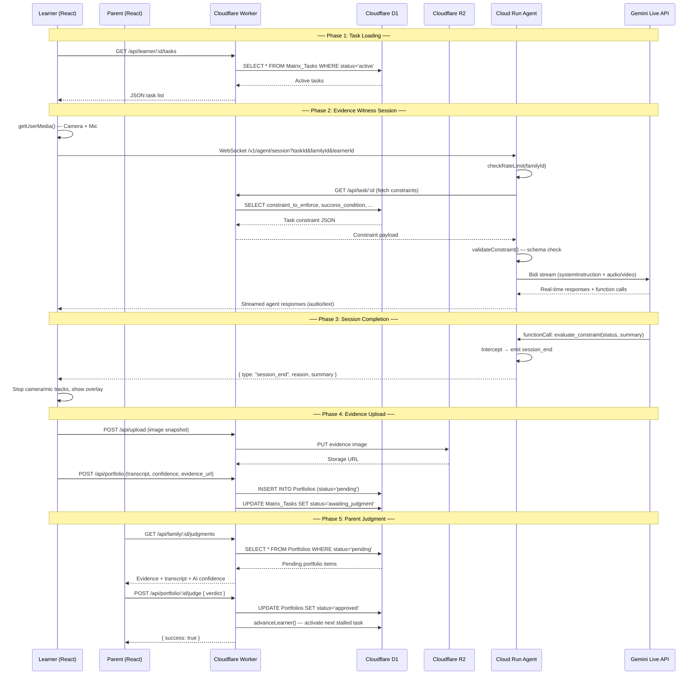

# Learn Live — System Architecture

> **Dual-Cloud Architecture**: Cloudflare (Edge Data & Storage) + Google Cloud (AI Agent Bridge)

---

## High-Level Overview

Learn Live uses a **split-cloud architecture** designed for low-latency, cost-efficient, and privacy-respecting AI-assisted learning:

| Layer | Service | Technology | Purpose |
|-------|---------|------------|---------|
| **Frontend** | React SPA | Vite + React 18 + Tailwind CSS | Child-facing Spartan UI & Parent Command Center |
| **Edge API** | Cloudflare Worker | Hono-style handler + D1 + R2 | Family/task/portfolio CRUD, evidence storage |
| **AI Bridge** | Cloud Run Agent | Node.js + Express + WebSocket | Real-time bridge between frontend and Gemini |
| **AI Engine** | Gemini Live API | `@google/genai` SDK (Bidi streaming) | Multimodal Evidence Witness (audio + video) |

---

## Sequence Diagram

---

## Component Details

### React Frontend (Cloudflare Pages)

- **Learner Dashboard**: Distraction-free, mobile-first interface with large touch targets (48px+) for children ages 3–7+
- **Evidence Witness**: Full-screen WebRTC component that captures `MediaStream` (camera + mic) and streams to the Agent via WebSocket
- **Parent Command Center**: Review AI-generated evidence, view transcripts and confidence scores, render final judgment
- **State Management**: Zustand stores for auth (`authStore`), UI state (`uiStore`), and profile switching

### Cloudflare Worker (Edge API)

- **D1 Database**: SQLite-based relational store for `Families`, `Learners`, `Matrix_Tasks`, and `Portfolios`
- **R2 Object Storage**: Immutable evidence vault for session snapshots and future audio/video artifacts
- **Key Endpoints**:
  - `GET /api/learner/:id/tasks` — active tasks for a learner
  - `GET /api/task/:id` — constraint payload for the Agent
  - `POST /api/upload` — evidence image → R2
  - `POST /api/portfolio` — create portfolio entry
  - `POST /api/portfolio/:id/judge` — parent verdict + progression trigger

### Cloud Run Agent (AI Bridge)

- **WebSocket Server**: Accepts frontend connections at `/v1/agent/session` with query parameters (`taskId`, `familyId`, `learnerId`)
- **Constraint Pipeline**: Fetches task constraints from the Worker, validates schema, and assembles the `systemInstruction` for Gemini
- **Rate Limiting**: Per-family daily session limits to control cost
- **Session Lifecycle**: Intercepts Gemini's `evaluate_constraint` function call to emit `session_end` events and gracefully terminate

### Gemini Live API

- **Multimodal Input**: Receives audio and video streams via bidirectional (Bidi) streaming
- **Role**: Acts as an "Evidence Witness" — observes, prompts, and evaluates but **never** holds moral authority
- **Constraint Enforcement**: Evaluates success/failure conditions defined in the 3D Responsibility Matrix and reports via structured function calls

---

## Design Principles

1. **No AI Authority**: The AI cannot auto-advance learners, generate grades, or bypass parental judgment
2. **Edge-First Data**: All relational data and evidence lives on Cloudflare's edge network for global low-latency access
3. **Cost Control**: Rate limiting, session timeouts, and API budget tracking prevent runaway Gemini costs
4. **Privacy by Design**: Evidence is scoped per-family in R2 — no cross-family data leakage
5. **Low-Bandwidth Resilience**: Minimal payloads, edge-cached assets, and graceful offline detection
