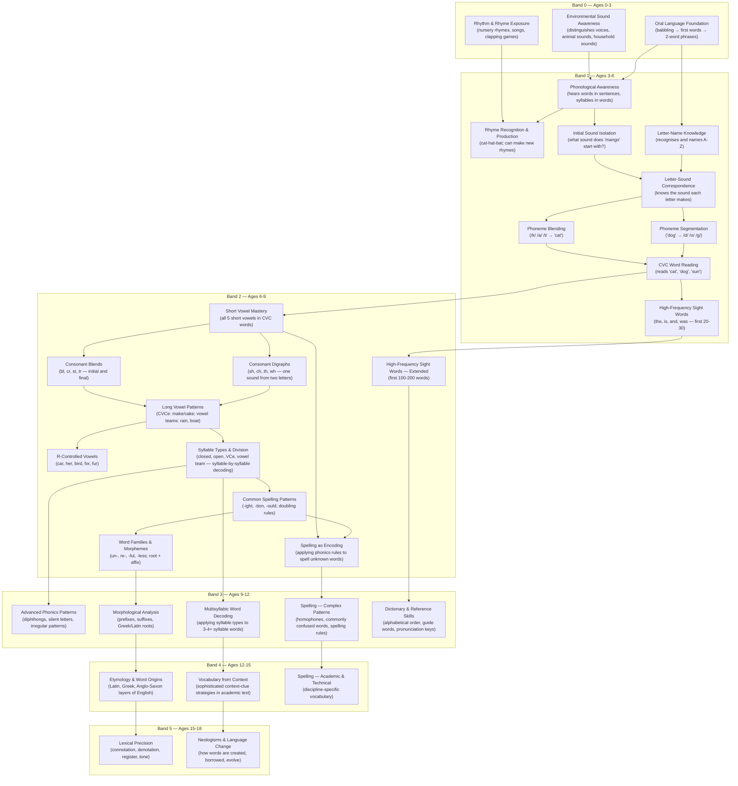
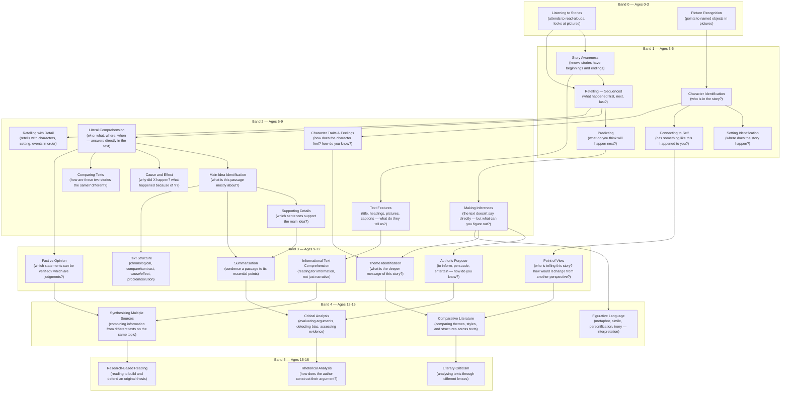
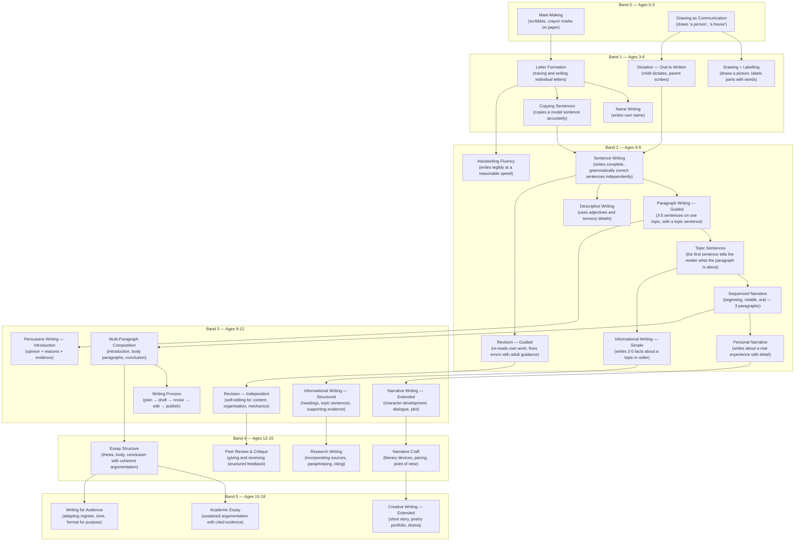
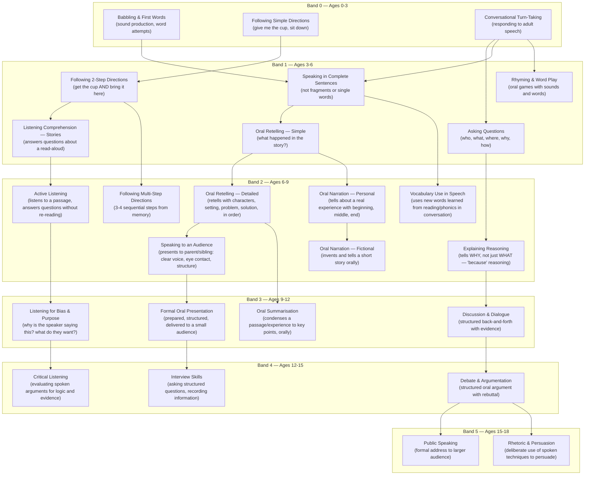

# Language & Literacy (English) Curriculum Spine

> The spine is the school. The app is infrastructure. The AI is the steward.

This document defines the **structure** from which all English Language & Literacy activities are generated. It maps birth through Grade 12 across five linguistic strands, six developmental bands, four cognitive levels, and one cross-cutting progression (Vocabulary & Word Consciousness).

**Structural compatibility:** This spine shares the same data model as the Mathematics spine — Strands, Capacities, Cognitive Levels, Repetition Arcs, Bands. Any capacity from this spine can be stored in the same database schema and processed by the same task engine.

---

## Part 0: Who Is This App For?

### The Parent Is the Primary User

Identical to Math. The parent opens the app, sees the task, leads the child through it, and records the outcome.

> [!IMPORTANT]
> At Band 2, the child does NOT read tasks off a screen independently as the default. The parent reads the prompt and leads the child. A read-only child portal is the parent's optional choice — never the default.

### The Flow at Every Band

```
Parent opens app → Sees today's task + constraint prompt →
  Option A: Parent leads the activity → Parent writes the report → Parent advances/revises
  Option B: Parent captures photo + audio → Async AI drafts the report → Parent reviews → Parent advances/revises
  Option C: Parent invokes Live AI Witness → AI observes in real-time → AI drafts report → Parent reviews
  Option D (Band 3+): Parent grants child access to Child Portal → Child leads → Parent reviews → Parent advances/revises
```

**Option A is always available. Options B, C, D are always optional. Option D unlocks gradually.**

### The Four Witness Modes

| Mode | How Evidence Is Captured | Cost / Bandwidth | When It's Used |
|---|---|---|---|
| **Parent Witness** | Parent observes, writes guided report | Free, offline-capable | Default at all bands. Always available. |
| **Async AI** | Photo of written work + 10-second audio clip of child reading/narrating → AI analyzes and drafts report | Low cost, low bandwidth | The workhorse: spelling checks, reading fluency, comprehension answers. |
| **Live AI Witness** | Real-time camera/mic → AI observes and interacts | Higher cost, needs stable connection | Oral narration, verbal reasoning, Discern-level challenges. |
| **Child-Led** | Child submits evidence (photos, recordings, written work) → AI or parent reviews | Varies | Band 3+. Parent grants portal access. |

> [!TIP]
> **Async AI is even more powerful for English than for Math.** A photo of a handwritten paragraph + a 10-second audio clip of the child reading it aloud gives the AI both the written output and the oral fluency data. This is the primary evidence capture method.

### The Split Judgment Model

| What Is Being Judged | Who Judges | Example |
|---|---|---|
| **Structural correctness** — spelling, grammar, punctuation, sentence structure | **AI** | "The sentence is missing a full stop. 'becuse' should be 'because'." |
| **Comprehension accuracy** — did the child correctly extract information from a text? | **AI or parent** | "The child says the main character is Tendo — correct per the passage." |
| **Narrative quality & coherence** — does the writing make sense? Is there a clear beginning, middle, end? | **Parent (always)** | "The story has three paragraphs but paragraph 2 doesn't connect to paragraph 1. Needs revision." |
| **Formation & character** — perseverance, revision willingness, work ethic | **Parent (always)** | "She revised twice without complaint and read her story aloud with confidence." |
| **Advancement** — is the child ready for more responsibility? | **Parent (always)** | "Spelling is AI-verified correct. Narration was clear. She also showed endurance. Advance." |

---

## Part I: Architecture of the Spine

### How a Spine Cell Works

Every teachable unit in English is a **Capacity**. Each Capacity lives at the intersection of:

| Axis | What It Represents | Example |
|---|---|---|
| **Strand** | The linguistic domain | Reading Comprehension |
| **Capacity** | The specific skill/concept | Identify the main idea of a short narrative paragraph |
| **Cognitive Level** | Depth of understanding | Execute (can do it under constraint) |
| **Repetition Arc** | Volume + type of practice | Endurance 2 of 3 (noise-injected task) |
| **Developmental Band** | Stage appropriateness | Band 2 (ages 6–9) |

**The app reads a cell** → generates a task instance → presents the constraint prompt to the parent → parent witnesses (or invokes AI) → evidence is logged → parent judges.

### The Four Cognitive Levels (English-Specific Definitions)

| Level | Name | What the Learner Does | What the Witness Checks (Parent or AI) |
|---|---|---|---|
| **1** | **Encounter** | Meets the concept through multi-sensory experience: hears, touches, sorts, imitates. Describes what they notice. | "Show me what you heard/saw. Tell me what you notice." |
| **2** | **Execute** | Performs the task under constraint. Produces a real, evaluable output (reads aloud, writes, answers, narrates). Oral precedes written: "say it, then write it." | Enforces constraint, checks output against success criteria. |
| **3** | **Discern** | Detects errors, compares approaches, explains *why* something is correct or incorrect. Edits, critiques, selects. | "What's wrong here? Which version is better? Why?" |
| **4** | **Own** | Creates original constrained work: designs tasks for others, writes under structural constraints, teaches a concept, produces original compositions. | Witnesses specification and defense — testing true ownership. |

### The Multi-Sensory Encounter Rule

> [!IMPORTANT]
> **Every new concept at Encounter level MUST include an auditory, physical, or verbal component.** Text-on-screen alone is NEVER sufficient for Encounter at Band 2. This is the English equivalent of Math's "Encounter = Physical manipulation always."

| Strand | Encounter Mode |
|---|---|
| **Phonics & Word Study** | Auditory + Physical: hear sounds, manipulate letter tiles/cards, trace letters |
| **Reading Comprehension** | Auditory + Visual: parent reads aloud, child listens and responds |
| **Grammar & Mechanics** | Physical + Visual: sentence strips, word cards sorted and rearranged |
| **Composition & Writing** | Oral → Physical: child dictates first, parent scribes, child copies/traces |
| **Oral Language & Listening** | Auditory + Verbal: listening comprehension and verbal imitation/response |

### The "Say It, Then Write It" Rule

> At **Execute** level, every written production task is preceded by an oral version. The child says the sentence, narrates the story, or spells the word aloud BEFORE writing it. This ensures the cognitive operation (composing, sequencing, encoding) is separated from the motor operation (handwriting).

### The Repetition Arc (Identical to Math)

| Stage | Count | What Happens | Why It Exists | Example (Main Idea, Execute) |
|---|---|---|---|---|
| **Exposure** | 1x | First encounter. Guided. Scaffolded. | Orientation — the child sees what this skill is. | "We'll read a paragraph together. I'll show you how to find the main idea." |
| **Execution** | 3–5x | Repeated practice with parameter variation. | Builds fluency through varied repetition. | "Find the main idea of Passage A. Now Passage B. Now a passage about animals instead of people." |
| **Endurance** | 2–3x | Same task + **noise injected**. Irrelevant details, misleading titles, mixed genres. | Tests robustness — can they do it when the situation is messy? | "This passage has a paragraph about the weather mixed in with a story about Amara. What is the MAIN idea — ignore the weather paragraph." |
| **Milestone** | 1x | **Cross-strand, unlabeled task**. Nobody tells the child which skill to use — they must recognise the situation and apply the correct capacity. | Tests transfer and recognition — the real proof of formation. | "Tendo wrote a letter to his friend. Read it. Then tell me: what is Tendo trying to say? Write one sentence." (Nobody says "main idea.") |

> [!IMPORTANT]
> **Execution count is capacity-dependent, not fixed.** Foundational capacities (phonemic awareness, sentence construction, paragraph structure) may need 5–7 executions. Procedural capacities (capitalisation rules, punctuation) may need 3. The parent decides when to move to Endurance.

### The AI Permission Rule

> A learner may use AI tools (spell-checkers, grammar tools, AI writing assistants) **only after** they can do three things without them:
> 1. **Predict** what a correct version should roughly look like
> 2. **Diagnose** what went wrong when the writing is bad
> 3. **Specify** constraints that meaningfully shape the output

This is **capacity-gated**, not age-gated.

---

## Part II: Developmental Bands

| Band | Ages | Grades | Core Mode | Who Leads | AI Witness | Parent Support |
|---|---|---|---|---|---|---|
| **0** | 0–3 | Pre-school | Auditory & Motor | Parent only | N/A | Guidance cards |
| **1** | 3–6 | Pre-K to K | Oral & Pre-Literacy | Parent leads | Optional (Async or Live) | Constraint prompts |
| **2** | 6–9 | Grades 1–3 | Decoding & Early Composition | Parent leads | Optional | Constraint prompts |
| **3** | 9–12 | Grades 4–6 | Fluent Reading & Structured Writing | Parent or Child | Available | **Parent primers** |
| **4** | 12–15 | Grades 7–9 | Analytical Reading & Essay Writing | Child leads | AI as collaborator | **Split judgment** |
| **5** | 15–18 | Grades 10–12 | Critical Literacy & Rhetoric | Child independent | AI as full tool | **Split judgment** + reviewer |

### The Critical Principle: Tasks Get Bigger, Not Easier

At every band transition:
- **Task scope expands** (from "read a sentence aloud" to "analyse an author's rhetorical strategy")
- **Constraints tighten** (from "write 3 sentences" to "write a persuasive essay with cited evidence")
- **AI tools unlock** — only because the task is now too big without them AND the student can evaluate the output
- **Child's independence increases** — but always at the parent's discretion
- **Parent's evaluation shifts** — from checking spelling directly to evaluating argumentation while AI checks mechanics

**AI does not replace the parent. AI does not replace handwriting or oral narration. AI makes tasks ambitious enough that manual checking alone would be insufficient.**

---

## Part III: The Five English Strands + One Cross-Cutting Progression

### The Five Strands (X-Axis)

| # | Strand | Description |
|---|---|---|
| 1 | **Phonics & Word Study** | The decoding engine. Letter-sound relationships → blending → syllables → morphemes → spelling patterns. |
| 2 | **Reading Comprehension** | Understanding connected text. From literal recall to inference to critical analysis. |
| 3 | **Grammar & Mechanics** | The structural rules of English. Sentence construction, punctuation, parts of speech, agreement. |
| 4 | **Composition & Writing** | The production strand. From sentences to paragraphs to structured narratives to essays. |
| 5 | **Oral Language & Listening** | Verbal fluency, narration, comprehension of spoken language, structured speaking. |

### The Cross-Cutting Progression: Vocabulary & Word Consciousness

Vocabulary is NOT a separate strand — it is a **progression that runs through every strand at every band**. Words are acquired through phonics (decoding), reading (context), grammar (word classes), writing (deliberate choice), and oral work (active use).

| Band | Vocabulary Capacity | What It Looks Like | Example Across Strands |
|---|---|---|---|
| **0** | **Receptive vocabulary** | Child understands words spoken to them in context. | "Bring me the big cup" — child selects correctly. |
| **1** | **Labelling & categorising** | Child names objects, actions, attributes. Groups words by meaning. | "What do we call this? What other animals can you name?" |
| **2** | **Active vocabulary & word families** | Child uses new words correctly in speech and writing. Recognises word families (happy → unhappy, happiness). | "Use the word 'enormous' in a sentence. What does 'un-happy' mean? If happy → unhappy, what about kind → ___?" |
| **3** | **Academic & transitional vocabulary** | Domain-specific terms, transition words (however, therefore), register awareness. | "Use a transition word to connect these two sentences. What does 'summarise' mean?" |
| **4** | **Precision vocabulary** | Connotation, etymology, rhetorical word choice. | "Why did the author use 'glared' instead of 'looked'? What's the root of 'incredible'?" |
| **5** | **Mastery & production** | Creates nuanced distinctions, controls register, deploys vocabulary strategically. | "Rewrite this paragraph for a formal audience. Now rewrite it as a letter to a friend." |

> [!IMPORTANT]
> Every capacity at every cognitive level should incorporate vocabulary. At **Encounter**, the child hears and imitates new words. At **Execute**, the child uses them in constrained tasks. At **Discern**, the child distinguishes word meanings and detects misuse. At **Own**, the child deploys vocabulary deliberately in original production. Vocabulary is not a bolt-on — it is the thread that runs through every cell.

---

## Part IV: Concept DAG — Strand 1: Phonics & Word Study

Every capacity is a node. Arrows show prerequisites.



> [!NOTE]
> **Spelling is a sub-capacity of this strand, not a separate strand.** Nodes PS2j (Spelling as Encoding) and PS3d (Spelling — Complex Patterns) are where spelling lives. Spelling is the *encoding* side of phonics — the same letter-sound knowledge used in reverse.

---

## Part IVb: Concept DAG — Strand 2: Reading Comprehension

Reading comprehension starts with listening comprehension (a pre-reader understands stories read aloud) and progresses to independent critical analysis of complex texts.



**Cross-Strand Links from Strand 2:**
- RC2a (Literal Comprehension) requires Strand 1 PS2a (Short Vowel Mastery) — the child must be able to decode before they can independently comprehend written text
- RC2b (Retelling with Detail) feeds into and shares with Strand 5 OL2b (Oral Retelling)
- RC2c (Main Idea) feeds into Strand 4 CW2c (Topic Sentences)

---

## Part IVc: Concept DAG — Strand 3: Grammar & Mechanics

Grammar is not an abstract rule system — it is the structure that makes meaning clear. At Band 2, grammar is taught through sentences the child can hold, rearrange, and construct.

```mermaid
graph TD
    subgraph "Band 1 — Ages 3-6"
        GM1a["Complete Sentence Awareness<br/>(knows a sentence is a complete thought)"]
        GM1b["Capital Letters — Sentence Start<br/>(sentences begin with capital letters)"]
        GM1c["Full Stops<br/>(sentences end with a dot)"]
        GM1d["Question Marks<br/>(questions end with ?)"]
        GM1e["Naming Words — Nouns<br/>(a noun names a person, place, or thing)"]
    end

    subgraph "Band 2 — Ages 6-9"
        GM2a["Sentence Types<br/>(statements, questions, exclamations, commands)"]
        GM2b["Nouns — Common & Proper<br/>(dog vs Tendo; school vs Kampala)"]
        GM2c["Verbs — Action Words<br/>(run, eat, write — the action in a sentence)"]
        GM2d["Adjectives — Describing Words<br/>(big, red, happy — describing nouns)"]
        GM2e["Subject-Verb Agreement<br/>(he runs / they run)"]
        GM2f["Singular & Plural Nouns<br/>(cat/cats, child/children, ox/oxen)"]
        GM2g["Verb Tenses — Simple<br/>(past: walked; present: walks; future: will walk)"]
        GM2h["Commas in Lists<br/>(I bought mangoes, rice, and beans)"]
        GM2i["Apostrophes — Possession<br/>(Amara's book, the dog's bowl)"]
        GM2j["Conjunctions — Simple<br/>(and, but, or, so, because)"]
        GM2k["Sentence Expansion<br/>(adding detail: who, where, when, how)"]
    end

    subgraph "Band 3 — Ages 9-12"
        GM3a["Pronouns<br/>(he, she, they, it — and agreement)"]
        GM3b["Adverbs<br/>(quickly, carefully, yesterday — modifying verbs)"]
        GM3c["Prepositions & Prepositional Phrases<br/>(on the table, beside the river)"]
        GM3d["Complex Sentences<br/>(main clause + subordinate clause)"]
        GM3e["Direct & Indirect Speech<br/>(\"I am happy,\" she said / She said she was happy)"]
        GM3f["Paragraph Structure<br/>(topic sentence, supporting details, concluding sentence)"]
        GM3g["Apostrophes — Contraction<br/>(can't, won't, they're)"]
    end

    subgraph "Band 4 — Ages 12-15"
        GM4a["Active & Passive Voice<br/>(the boy kicked the ball / the ball was kicked)"]
        GM4b["Clauses & Phrases — Formal<br/>(independent, dependent, relative clauses)"]
        GM4c["Semicolons & Colons<br/>(connecting related ideas; introducing lists)"]
        GM4d["Subject-Verb Agreement — Complex<br/>(neither...nor, collective nouns, intervening phrases)"]
        GM4e["Sentence Variety & Rhythm<br/>(varying length and structure for effect)"]
    end

    subgraph "Band 5 — Ages 15-18"
        GM5a["Rhetorical Grammar<br/>(grammar as a tool for persuasion and style)"]
        GM5b["Register & Formality<br/>(adjusting grammar for audience and purpose)"]
        GM5c["Editing for Publication<br/>(final-draft standard grammar and mechanics)"]
    end

    GM1a --> GM2a
    GM1b --> GM2a
    GM1c --> GM2a
    GM1d --> GM2a
    GM1e --> GM2b
    GM1a --> GM2c
    GM2b --> GM2d
    GM2c --> GM2e
    GM2b --> GM2f
    GM2c --> GM2g
    GM2a --> GM2h
    GM2b --> GM2i
    GM2a --> GM2j
    GM2d --> GM2k
    GM2j --> GM2k
    GM2b --> GM3a
    GM2d --> GM3b
    GM2b --> GM3c
    GM2j --> GM3d
    GM2k --> GM3d
    GM2g --> GM3e
    GM2k --> GM3f
    GM2i --> GM3g
    GM2g --> GM4a
    GM3d --> GM4b
    GM2h --> GM4c
    GM2e --> GM4d
    GM3d --> GM4e
    GM4b --> GM5a
    GM4e --> GM5b
    GM4c --> GM5c
```

**Cross-Strand Links from Strand 3:**
- GM2a (Sentence Types) is a prerequisite for Strand 4 CW2a (Sentence Writing) — a child cannot compose sentences without knowing what a sentence is
- GM2e (Subject-Verb Agreement) feeds into Strand 4 CW2b (Paragraph Writing) — grammatical sentences are required for coherent paragraphs
- GM3f (Paragraph Structure) is shared with Strand 2 RC3c (Text Structure) — understanding paragraph structure is both a reading and a grammar skill

---

## Part IVd: Concept DAG — Strand 4: Composition & Writing

Writing is the production strand. It depends heavily on phonics (encoding), grammar (correctness), and reading (models of good writing). Writing tasks are always constrained.



**Cross-Strand Links from Strand 4:**
- CW2a (Sentence Writing) requires Strand 3 GM2a (Sentence Types) AND Strand 1 PS2a (Short Vowel Mastery) — a child cannot write sentences without basic grammar knowledge and encoding ability
- CW2d (Sequenced Narrative) requires Strand 2 RC2b (Retelling with Detail) — a child must be able to comprehend and retell story structure before producing it
- CW2h (Handwriting Fluency) is an independent motor capacity within this strand — content quality is evaluated separately from legibility

---

## Part IVe: Concept DAG — Strand 5: Oral Language & Listening

Oral language is the foundation of all literacy. At Band 2, a child's spoken vocabulary and comprehension typically exceed their reading and writing abilities. This strand trains structured verbal output, active listening, and oral presentation.



**Cross-Strand Links from Strand 5:**
- OL2b (Oral Retelling — Detailed) is shared with Strand 2 RC2b (Retelling with Detail) — the same capacity, one oral, one after reading
- OL2e (Vocabulary Use in Speech) connects to the cross-cutting Vocabulary progression and Strand 1 PS2h (Word Families)
- OL2h (Explaining Reasoning) is equivalent to the Reasoning & Proof cross-cutting in Math — "because" reasoning

---

## Part V: Capacity Detail — Fully Worked Examples

### Example 1: Main Idea Identification (Band 2)

**Capacity**: Main Idea Identification | **Strand**: Reading Comprehension | **Band**: 2

This capacity teaches the child to distinguish what a passage is *mostly about* from the supporting details.

#### Cognitive Level 1: Encounter

| Field | Value |
|---|---|
| **Task type** | Auditory + Visual (read-aloud) |
| **Materials** | A short illustrated passage (3–5 sentences) read aloud by the parent |
| **What child does** | Listens to the passage. Looks at the picture. Says what the passage was "mostly about." |
| **Success** | Child identifies the overarching topic, not a single detail |
| **Failure** | Child names a detail ("It was about a red bird") instead of the main idea ("It was about birds building nests") |
| **Reasoning check** | "How do you know that's what it's mostly about? What clue did you use?" |
| **Default witness** | **Parent.** Prompt: "Read this passage aloud to your child. Ask: 'What was that mostly about?' If they give a detail, ask: 'Is that what the WHOLE passage was about, or just one part?'" |
| **AI witness** | Async: audio clip of child answering. Live: optional for verbal reasoning. |

#### Repetition Arc for This Capacity at Execute Level

| Stage | What Happens |
|---|---|
| **Exposure** (1x) | "We'll read this paragraph together. I'll show you how to find the main idea — it's what ALL the sentences are about." |
| **Execution** (4x) | "Read Passage A. What is the main idea? Read Passage B — different topic, same question. Read Passage C — this one is about animals. Read Passage D — this one is about a person." Parameter variation. |
| **Endurance** (2x) | "This passage has a paragraph about the weather mixed in with a story about Amara's garden. What is the MAIN idea — ignore the extra paragraph." Noise injection. |
| **Milestone** (1x) | "Tendo wrote a letter to his friend. Read it. Then tell me: what is Tendo trying to say? Write one sentence." Cross-strand, unlabeled. Nobody says "main idea." |

### Example 2: Sentence Writing (Band 2)

**Capacity**: Sentence Writing | **Strand**: Composition & Writing | **Band**: 2

This capacity teaches the child to produce complete, grammatically correct, original sentences.

#### Cognitive Level 2: Execute (Say It, Then Write It)

| Field | Value |
|---|---|
| **Task type** | Oral → Written production |
| **Materials** | Lined notebook, pencil |
| **What child does** | (1) Looks at a picture prompt. (2) Says a complete sentence about it aloud. (3) Parent confirms the sentence is grammatically complete. (4) Child writes the sentence. |
| **Success** | Written sentence matches oral sentence. Begins with capital letter. Ends with full stop. Contains a subject and verb. Spelling is phonetically reasonable (errors in irregular words are acceptable). |
| **Failure** | Fragment, no capital letter, no full stop, or sentence does not match what was said aloud. |
| **Reasoning check** | "Read your sentence back to me. Does it sound complete? Does it make sense on its own?" |
| **Default witness** | **Parent.** Prompt: "Show your child the picture. Ask them to say a sentence about it. If the sentence is complete, say 'Good — now write it.' If it's a fragment, ask: 'Can you make that into a full sentence?'" |
| **AI witness** | Async: photo of written sentence + audio of child reading it back. AI checks: capital letter, full stop, subject-verb presence, spelling. |

### Example 3: Band 0 — Newborn to Age 3 (Pre-Literacy Formation)

Auditory and oral experiences that build neural infrastructure for language. Parent does them. No AI.

| Capacity | Activity | Why It Matters |
|---|---|---|
| **Environmental Sound Awareness** | "What's that sound? That's a rooster! That's rain on the roof!" | Foundation of phonological awareness — distinguishing sounds. |
| **Rhythm & Rhyme** | Singing songs, clapping syllables, nursery rhymes | Foundation of phonemic awareness and prosody. |
| **Oral Language Foundation** | Talking to the child constantly. Naming everything. Narrating actions. | Foundation of vocabulary, syntax, and comprehension. |
| **Following Simple Directions** | "Give mama the cup." "Put the shoe by the door." | Foundation of listening comprehension and sequencing. |
| **Conversational Turn-Taking** | Pause after speaking to the child. Wait for response (even babbling). Respond to their sounds. | Foundation of dialogue, oral narration, and structured speech. |
| **Story Time** | Daily read-alouds with picture books. Point at pictures. Ask "what's that?" | Foundation of reading comprehension and story awareness. |

---

## Part VI: How the Parent's Role Evolves Across Bands

### Band 0: Parent Does Everything

- App surfaces one guidance card per day
- Activities are woven into daily life (reading aloud, singing, talking, naming objects)
- No camera, no AI, no screen for the child

### Band 1: Parent Leads, AI Optional

- Parent sees task + constraint prompt → reads aloud to child → facilitates oral activity → writes brief report
- **OR** captures photo + audio → Async AI drafts report → parent reviews
- The child never opens the app. Parent is driving.

### Band 2: Parent Leads, Child Starts Seeing Tasks

- Parent MAY create a child portal (read-only) so child can see their task list
- Async AI becomes the workhorse: photo of written work + audio clip of child reading
- Parent can always do it themselves with the constraint prompt
- Oral activities precede written ones ("say it, then write it")

### Band 3: The Transition — Child Starts Leading

- Parent may grant child **task execution access**
- **Parent receives "parent primers"** — brief orientations explaining grammar concepts, comprehension strategies, and writing structures
- Revision becomes the child's responsibility (parent reviews, child fixes)
- AI Witness can now interact directly with the child (if parent permits)

### Band 4–5: Child Leads, Parent Oversees

- **Split judgment activates**: AI checks spelling, grammar, structural compliance; parent checks coherence, argumentation, and formation
- Child operates own portal. Tasks are substantial (essays, research writing, literary analysis)
- Parent reviews portfolio periodically. May designate a qualified reviewer for writing quality.
- Parent retains advancement authority

### The Rules That Hold Across All Bands

> **1. The parent is ALWAYS the final judge of advancement.** No band removes this.
>
> **2. AI never replaces the cognitive operation the task is designed to form.** (AI doesn't write the child's sentences. AI doesn't narrate the child's story.)
>
> **3. The constraint prompt serves the parent first.** The parent always sees it.
>
> **4. AI Witness is always optional.** Async is the workhorse, Live is premium.
>
> **5. Competence judgment may be delegated; formation judgment may not.**

---

## Part VIb: The Worksheet Layer (English Adaptation)

Worksheets follow activities — they are consolidation and fluency tools, not teaching mechanisms. The structure adapts to the nature of English tasks.

### Worksheet Structure — Reading & Comprehension Capacities

| Section | Purpose | Example (Main Idea Identification, Execute) |
|---|---|---|
| **Worked Example** | A fully solved example showing the skill AND the reasoning. | "Read this paragraph. The main idea is: 'Amara's family grows matooke.' We know this because every sentence talks about their matooke farm. The sentence about the weather is a detail, not the main idea." |
| **Execution Passages** | 3–5 short passages with questions. Parameters vary (topic, length, question type). | "Read Passage A. What is the main idea? Which sentence is a supporting detail?" |
| **Endurance Passage** | 1–2 passages with noise: irrelevant paragraphs, misleading titles, tricky details. | "This passage has two paragraphs. Only ONE is about the main topic. Which one?" |
| **Milestone Task** | Unlabeled, cross-strand. Nobody says which skill is being tested. | "Tendo wrote a letter. Read it. What is he trying to say? Write one sentence." |

### Worksheet Structure — Writing & Composition Capacities

| Section | Purpose | Example (Sequenced Narrative, Execute) |
|---|---|---|
| **Worked Example** | A model text showing structure explicitly. | "Look at this story: Paragraph 1 sets the scene. Paragraph 2 introduces the problem. Paragraph 3 shows the solution." |
| **Execution Prompts** | 3 writing prompts, each requiring the same structure with different content. | "Write a 3-paragraph story about: (1) a day at the market, (2) a lost animal, (3) a rainy day surprise." |
| **Endurance Prompt** | 1 prompt with layered constraints. | "Write a 3-paragraph story. You MUST include a character named Nala AND use 3 vocabulary words AND include a question." |
| **Milestone Prompt** | Unlabeled. The child must impose structure themselves. | "Write a letter to your cousin about your favourite day this month." (Nobody says "3 paragraphs" or "beginning/middle/end.") |

### Activity & Worksheet Rules

| Rule | Description |
|---|---|
| **Encounter = Multi-sensory always** | Every new concept at Encounter MUST have at least one auditory, physical, or verbal activity. A worksheet alone is never sufficient. |
| **Execute = "Say it, then write it"** | Oral production precedes written production. If a child cannot say it, they return to oral practice, not to more writing. |
| **Endurance = Noise injection** | Same as Math. Irrelevant information, unfamiliar contexts, deliberate distractors. |
| **Own = Active production only** | The Own cognitive level is always a design, teaching, or creation task. NEVER a worksheet. The child produces something original under constraint. |
| **Minimum per capacity** | At least 1 multi-sensory activity (Encounter) + 1 execution task set + 1 milestone task + 1 Own task = 4 task instances minimum per capacity. |

---

## Part VIc: The Marking Model (English-Specific)

### Split Marking (Adapted for Language)

| Problem Type | Who Marks | How |
|---|---|---|
| **Spelling** | **AI** | Binary check. Auto-markable. |
| **Grammar & Mechanics** (capitals, punctuation, S-V agreement) | **AI** | Rule-based + LLM check. Auto-markable for simple rules. |
| **Reading Comprehension — Literal** | **AI** | Compare child's answer against text. Binary for explicit questions. |
| **Reading Comprehension — Inferential** | **Parent with AI assist** | AI drafts rubric check ("Child identified cause-and-effect: ✓/✗"). Parent confirms. |
| **Writing — Structural compliance** | **AI** | Countable criteria: paragraph count, sentence count, vocabulary word usage. Binary. |
| **Writing — Quality & Coherence** | **Parent** | AI provides a prompt: "Does the story have beginning/middle/end? Does each paragraph connect?" Parent checks yes/no. |
| **Oral narration** | **Live AI or Async AI** | AI evaluates: vocabulary used, story structure, fluency. AI drafts structured report. Parent reviews. |
| **Milestone tasks** | **Parent always** | Parent evaluates: Did the child recognise the task type? Did they apply the right strategy? Did they explain their reasoning? |

### Handwriting Evaluation

| Step | What Happens |
|---|---|
| 1 | Parent photographs the handwritten work. |
| 2 | AI attempts OCR. If confidence ≥ threshold, AI proceeds to evaluate content. |
| 3 | If confidence < threshold, AI routes to parent: "I couldn't read this clearly. Please transcribe." |
| 4 | Handwriting legibility is tracked as a sub-capacity within Composition (CW2h). Content quality is evaluated independently. |

### Why Not Fully Automated Marking for English?

Writing quality, narrative coherence, and inferential reasoning require human judgment. Fully automated marking would reduce the system to spell-checking and grammar-checking, which contradicts the spine's purpose: forming children who can produce meaningful, structured, original text under constraint.

---

## Part VId: Progress & Assessment

### Capacity-Based Progress Map (Identical to Math)

| State | Symbol | Meaning |
|---|---|---|
| Not yet started | ○ | No tasks attempted |
| At Encounter | ◐ | Met the concept through multi-sensory experience |
| At Execute | ◑ | Can perform under constraint (with repetition count: e.g., 3/5) |
| At Endurance | ◕ | Handles noise and distraction |
| Milestone passed | ● | Demonstrated transfer in unlabeled, cross-strand context |
| Capacity Owned | ★ | All four cognitive levels complete. Capacity is formed. |

> [!CAUTION]
> **This system does not produce letter grades or percentage scores.** A parent can generate a readable progress report at any time.

### What the Progress Report Looks Like

> **Learner: Azie | Date: March 2026 | Band: 2**
>
> **Phonics & Word Study:** 7 of 10 capacities owned. Working on: Long Vowel Patterns (at Execute, 3/5 repetitions) and R-Controlled Vowels (at Encounter).
>
> **Reading Comprehension:** 4 of 9 capacities owned. Working on: Cause and Effect (at Discern). Making Inferences (at Execute).
>
> **Grammar & Mechanics:** 6 of 11 capacities owned. Working on: Verb Tenses (at Endurance). Conjunctions (at Execute).
>
> **Composition & Writing:** 3 of 9 capacities at Execute. Working on: Paragraph Writing (at Execute, 2/4 repetitions). Handwriting Fluency ★.
>
> **Oral Language & Listening:** 5 of 8 capacities owned. Working on: Oral Narration — Fictional (at Discern).

---

## Part VIe: Constraint Template Standard

Every constraint template must conform to this standard (same schema as Math, with English-specific adaptations).

### Required Fields Per Template

| Field | Type | Description |
|---|---|---|
| `capacity_id` | string | DAG node ID (e.g., "RC2c") |
| `strand` | int | Strand number (1–5) |
| `band` | int | Band number (0–5) |
| `cognitive_level` | enum | Encounter, Execute, Discern, Own |
| `task_type` | string | Read-aloud, oral narration, written production, error detection, design, etc. |
| `materials` | string[] | Required materials. Must be locally available. |
| `parent_prompt` | string | The exact prompt shown to the parent. |
| `success_condition` | string | What a successful completion looks like. |
| `failure_condition` | string | What failure looks like and what to do about it. |
| `reasoning_check` | string | **Required at every cognitive level.** The specific reasoning question. |
| `repetition_arc` | object | Execution count, Endurance variants, Milestone reference. |
| `context_variants` | object | **Localisation.** Culture-specific substitutions for names, settings, stories, food, and scenarios. |
| `worksheet` | object | Worked example, execution tasks, endurance tasks, milestone task. |
| `parent_primer` | string | **Band 3+ only.** Concept orientation for the parent (<200 words). |
| `text_passage` | string | **Reading Comprehension only.** The actual passage the child reads. Includes localised variants. |
| `oral_component` | boolean | **Whether this task requires an oral step before the written step** (true for all Execute-level writing tasks at Band 2). |

### Reasoning Check Standard (English-Specific)

| Cognitive Level | Reasoning Check Pattern | Example |
|---|---|---|
| **Encounter** | "What do you notice? Tell me what you heard/saw." | "What was that story about? What did you notice about the sounds?" |
| **Execute** | "How do you know? Why did you choose that?" | "How do you know that's the main idea? Why did you put a full stop there?" |
| **Discern** | "What is wrong here? Which is better? Why?" | "This sentence has a mistake. What is it? Here are two paragraphs — which one is better organised? Why?" |
| **Own** | "Explain your choices. Teach someone else." | "Why did you structure your story this way? Explain to your brother how to write a paragraph." |

### Localisation: The `context_variants` Field

```json
{
  "context_variants": {
    "default": {
      "names": ["Alex", "Sam", "Pat"],
      "settings": ["a park", "a school", "a farm"],
      "food": ["apples", "bread", "milk"],
      "currency": "dollars"
    },
    "ug": {
      "names": ["Amara", "Tendo", "Nala", "Azie", "Arie"],
      "settings": ["a market in Kampala", "a village school", "a garden by Lake Victoria"],
      "food": ["mangoes", "matooke", "groundnuts", "chapati"],
      "currency": "UGX"
    }
  }
}
```

---

## Part VIf: Cross-Strand Routing Rule (Hard Gate)

> **A child may not begin a capacity that has a cross-strand prerequisite until that prerequisite capacity is at Execute level or above in the source strand.**

This is a **hard gate** identical to Math. Examples for English:

- CW2a (Sentence Writing, Strand 4) requires GM2a (Sentence Types, Strand 3) at Execute or above.
- RC2a (Literal Comprehension, Strand 2) requires PS2a (Short Vowel Mastery, Strand 1) at Execute or above — a child must decode to comprehend independently.
- CW2d (Sequenced Narrative, Strand 4) requires RC2b (Retelling with Detail, Strand 2) at Execute or above — you must understand story structure before producing it.

---

## Part VII: What the Full Spine Requires (Next Steps)

### 1. Concept DAGs
- [x] **Strand 1**: Phonics & Word Study (23 nodes, Band 0–5)
- [x] **Strand 2**: Reading Comprehension (22 nodes, Band 0–5)
- [x] **Strand 3**: Grammar & Mechanics (22 nodes, Band 1–5)
- [x] **Strand 4**: Composition & Writing (20 nodes, Band 0–5)
- [x] **Strand 5**: Oral Language & Listening (20 nodes, Band 0–5)

### 2. Cross-Strand Infrastructure
- [x] Shared nodes identified (Retelling, Vocabulary, Sentence Structure, Paragraph Structure)
- [x] Cross-strand dependency rule defined (hard gate at Execute, same as Math)
- [x] No independent Strand 5 capstone at Band 2 (deferred to Band 3+)

### 3. Constraint Templates
Each (Capacity × Cognitive Level) needs 3–5 templates. For Band 2 specifically:

| Strand | Band 2 Capacities | Cognitive Levels | Templates (at 3–5 each) |
|---|---|---|---|
| Phonics & Word Study | 10 | × 4 = 40 cells | 120–200 |
| Reading Comprehension | 9 | × 4 = 36 cells | 108–180 |
| Grammar & Mechanics | 11 | × 4 = 44 cells | 132–220 |
| Composition & Writing | 9 | × 4 = 36 cells | 108–180 |
| Oral Language & Listening | 8 | × 4 = 32 cells | 96–160 |
| **Total** | **47 capacities** | **188 cells** | **564–940 templates** |

Strategy: build Band 2 first (pilot), validate with real children, then expand.

### 4. Text Passages (Reading Comprehension)
- [ ] Write 50+ graded passages for Band 2 (3–8 sentences each)
- [ ] Localise: Ugandan settings, characters, contexts
- [ ] Vary genre: narrative, informational, letter, instruction
- [ ] Ensure each passage maps to specific comprehension capacities

### 5. Parent Primers (Band 3+)
- [ ] Write concept orientations for every Band 3+ capacity
- [ ] Include: what the concept is, why it matters, common mistakes, what to look for
- [ ] Keep each primer under 200 words

### 6. Repetition Arc Calibration
- [ ] Set Execution count per capacity (foundational capacities like phonemic awareness need more reps)
- [ ] Design noise-injection rules for Endurance
- [ ] Design cross-strand Milestone tasks
- [ ] Pilot the arc with real children at Band 2

### 7. Handwriting Legibility Rubric
- [ ] Define legibility standards per band (Band 2: letter formation, spacing, size consistency)
- [ ] Calibrate OCR confidence thresholds for children's handwriting
- [ ] Define when legibility routes to parent vs. AI

---

## Part VIII: The Spine Is the School

The philosophy says *what education is*.
The spine says *what is taught, in what order, at what depth*.
The matrix says *how the data is structured*.
The AI says *nothing* — it reads the spine and obeys.

For English, the spine carries an additional weight: **language is the medium of all other learning.** A child who cannot read, write, and speak with clarity and structure cannot engage with any other domain — not mathematics, not science, not scripture.

Language & Literacy is not merely one subject among many. It is the infrastructure of thought itself.

**The spine is the hardest thing to build. It is also the only thing that matters.**
